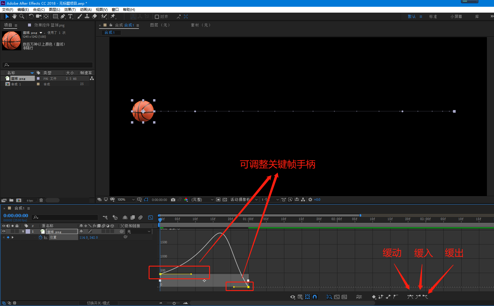
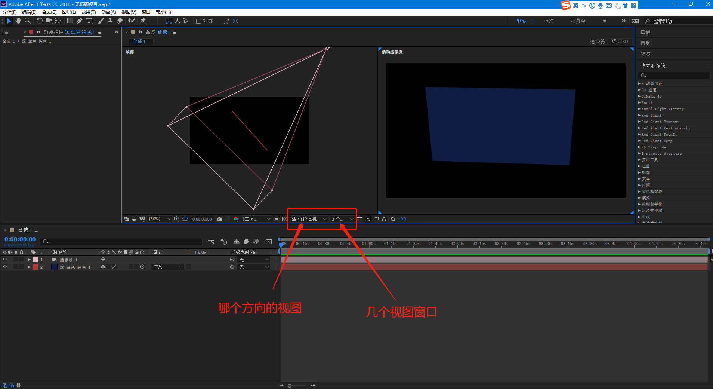
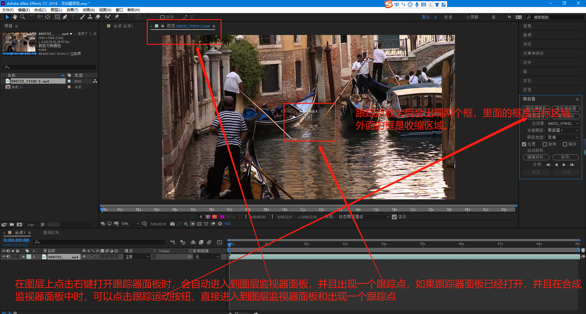
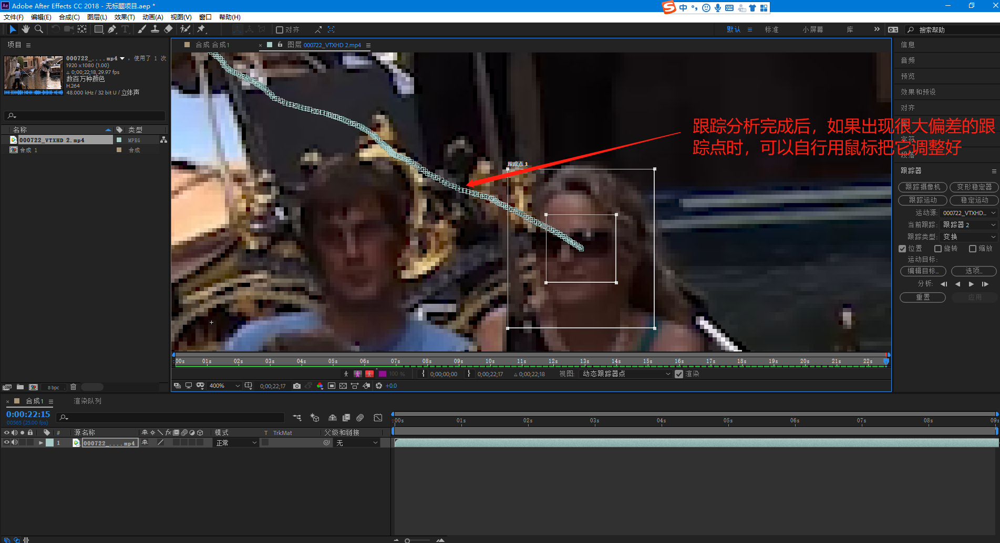
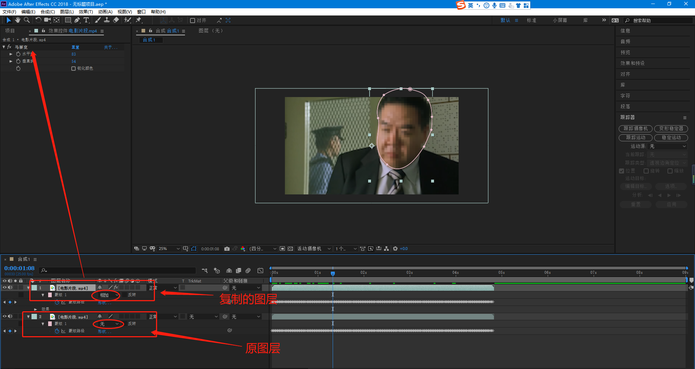
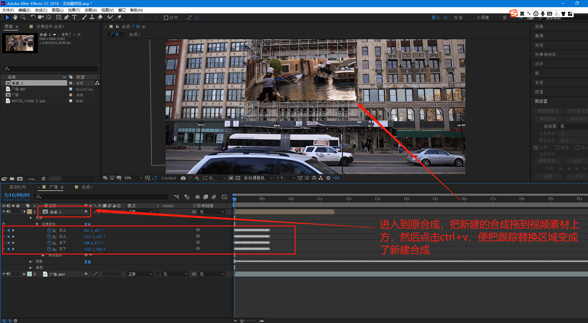
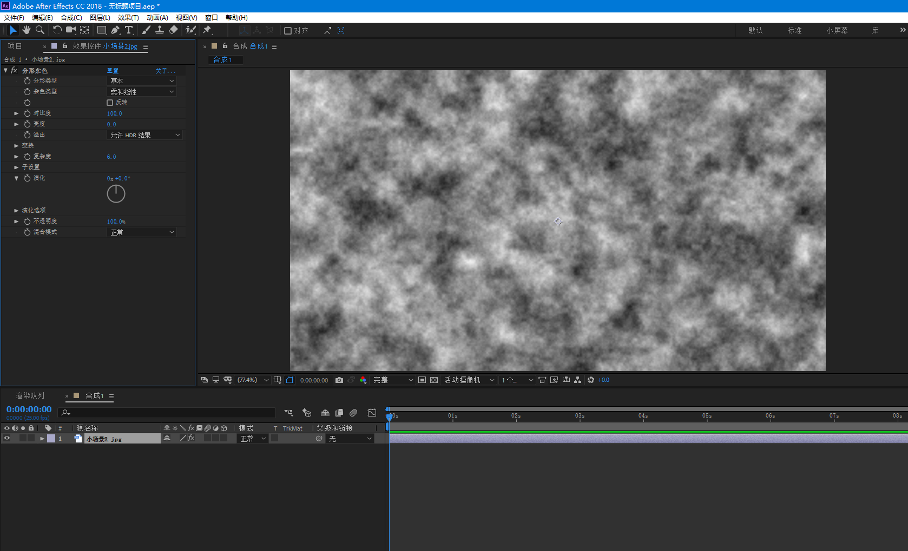
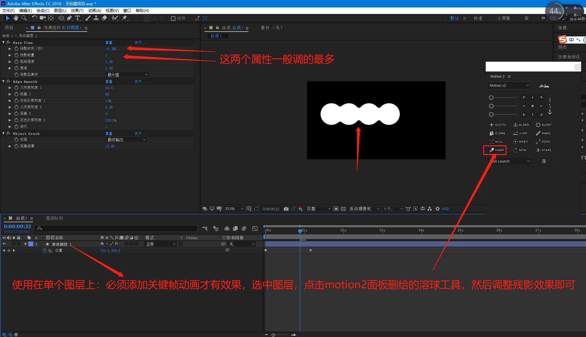

# After Effects

## 首选项

##### 新安装软件必改项

## 新建合成

## 导入素材

#### 图片序列

#### PSD文件

#### rmvb、mkv、flv等

这些视频格式的素材需要先用格式工厂先转换成MP4格式才能导入到ae项目中。

## 图层五大基本属性（锚点、位置、缩放、旋转、不透明度）

##### 锚点工具

一般修改锚点，是用锚点工具来修改，关键帧动画需要在变换属性里面连同位置和锚点一同打上关键帧（如果已经做了位置的关键帧动画，再用这个修改锚点会出现错误，这时只能用motion2脚本来改变锚点）

## 合成面板、图层面板、素材面板

#### 合成面板（查看器）

## 图层列表面板

#### 父子链接

## 预合成

相当于给某些图层嵌套成一个新合成，类似于pr的嵌套序列

选中某些图层——右键——预合成

## 关键帧动画

用法和pr一样

快捷键u  调出选中图层所有含有关键帧的属性

### 自动定向

选中图层，菜单栏：图层——变换——自动定向（ctrl+alt+o）

### 按时间等比压缩关键帧

### 动画曲线

路径曲线

#### 缓动、缓入、缓出

选中一个或多个关键帧，点击右键——关键帧辅助——缓动（F9）、缓入、缓出

#### 关键帧差值

#### 曲线图表

##### 速度曲线

#### 关键帧定格

#### 漂浮穿梭时间

## 时间

### 快放、慢放

#### 整体

选中图层——右键——时间——时间伸缩。

#### 部分

选中图层——右键——时间——启用时间重映射。AE的部分慢放和快放，视频声音也会跟着快放和慢放。

#### 慢放卡顿问题

### 倒放

选中图层——右键——时间——时间反向图层。取消方式再次点击一遍即可

### 冻结帧

选中图层——右键——时间——冻结帧。只对视频有效。

### 在最后一针冻结

选中图层——右键——时间——在最后一针冻结。只对视频有效。

## 蒙版

蒙版绘制后，也可以勾选反转

### 形状工具

一定要选中图层，再绘制，不选择图层绘制的是形状图层。

#### 个性化蒙版

如果调整过这些工具，第二次使用时会记录下原来调整的样子，这时候想恢复成默认，需要先点击图层，然后双击一下对应的绘制工具按钮，再单击绘制工具按钮进行绘制即可。

下面图片里写的一直按左键和一直按右键是指方向键

下面图片里写的一直按左键和一直按右键是指方向键

### 钢笔工具

蒙版羽化工具，用的比较少，因为蒙版属性中有羽化属性，还能做关键帧动画

### 蒙版属性

### 多个蒙版布尔运算

### 引用ps、AI形状图层为AE蒙版

在ps或AI中框选复制形状图层上的点，然后粘贴到AE的图层上即会生成一个蒙版，蒙版照常使用。

## 轨道遮罩

## 形状图层

### 形状、钢笔工具、个性化形状

不要选中任何图层（选中绘制的是蒙版），用形状工具或钢笔工具绘制出的是形状，并自动生成形状图层。形状工具（含个性化形状）和钢笔工具绘制方法同蒙版，请查看蒙版的形状工具和钢笔工具使用方法。

### 填充和描边

### 渐变填充

### 形状蒙版切换

### 形状属性

#### 多样化属性

##### 中继器

##### 修剪路径

### AI矢量图层转形状

选中AI矢量图层点击右键——创建——从矢量图层转形状，即可转为形状图层，形状图层的功能照常使用。

## 文本

工具栏和新建里面都可以创建文本图层

### 路径文本

### 锚点分组

### 文本动画

#### 预设

### 从文本创建形状

### 从文本创建蒙版

### ps文本转为文本图层

## 三维图层

## 摄像机

创建摄像机图层，直接新建——摄像机

### 摄像机视图

### 摄像机变换属性动画

### 景深

### 高光(曝光)

## 灯光

创建灯光图层，直接新建——灯光

### 类型

点光源：四面八方照射的灯，类似于灯泡

聚光灯：有方向和照射锥形度，类似于手电筒

平行光：类似于太阳光，不常用

环境光：通常用于全局补光

### 衰减

### 投影

使用投影必须同时打开灯光和物体的阴影才可以看到效果。

## 图层样式

## 图层混合模式

## 跟踪器

### 一点跟踪

主要是对位移进行跟踪。

### 两点跟踪

使用方法基本和一点跟踪一样，但是一点跟踪一般只能跟踪位移，两点跟踪可以把旋转和缩放一起跟踪上，注意两点跟踪只适合跟踪比较规则的物体旋转缩放运动。下面只介绍和一点跟踪不一样的地方。

### 四点跟踪

使用方法基本和上面的跟踪一样，但是四点点跟踪不是跟踪的变换属性，而是跟踪的边角定位。下面介绍四点跟踪的用法区别。

### 蒙版跟踪

例如面部加马赛克

#### 脸部跟踪（详细五官）

前面步骤同蒙版跟踪

### Mocha跟踪(面跟踪)

必需要先安装quicktime播放器，如还有问题再重启一下电脑

## 变形稳定器VFX

## 特效

特效预设主要分三种，内置预设、外置预设、自定义预设

### 自定义预设

特效做好后可以保存预设，这种预设称为自定义预设

### 风格化

#### 阈值(黑白)

#### 散布

#### CC Hextile(六边形)

#### CC kaleida(万花筒)

#### CC Vignette(四角压暗)

#### 马赛克

#### 动态拼贴

#### 发光

#### 查找边缘

#### 毛边

### 模拟

#### CC Pixel Polly(破碎)

#### CC Rainfall(下雨)

#### CC Snowfall(下雪)

#### CC Star Burst(星空)

#### 碎片

### 扭曲

#### CC Blobbylize(水滴状|金属感)

#### CC Page Turn(翻页)

#### 光学补偿

#### 湍流置换

### 生成

#### CC Light Sweep(扫光)

#### 填充

#### 梯度渐变(含径向渐变)

#### 高级闪电

### 时间

#### CC Force Motion Blur(强制运动模糊)

#### 残影

### 通道

#### 反转

#### 移除颜色遮罩

带通道图形或抠像后去除边缘杂色的时候用

#### 设置遮罩

如果两个图层不相邻时需要设置遮罩时就用这个特效

### 透视

#### 斜面Alpha

### 音频

#### 倒放

此特效添加后，说的话什么都听不懂，适合做外星人语言

### 杂色和颗粒

#### 分形杂色(噪波)

#### 中间值(常用于去水印)

#### 移除颗粒

### 遮罩

#### 遮罩阻塞工具

通常用于抠像后

#### 简单阻塞工具(常用于溶球特效)

## 保存低版本

菜单栏：文件——另存为——将副本另存为CC(14)…   AE CC2017版本

菜单栏：文件——另存为——将副本另存为CC(13)…   AE CC2015版本

## 清理缓存

项目太大，特别卡时，可以尝试清理一下缓存

菜单栏：编辑——清理——清理所有内存与磁盘缓存

## 输出单帧

菜单栏：合成——帧另存为——Photoshop图层

需要先选中合成工作面板，才能输出单帧，只能输出PSD文件，并且包含所有图层，PSD文件每个图层对应合成的每个图层。

## 输出

下载quicktime播放器

## 项目转移、备份

菜单栏：文件——整理工程(文件)——收集文件

收集成功后，即可整个目录转移或备份

## 替换图层上的素材

如果图层上的素材已经调整好，要用其它素材替换，可以先选中图层，再选中替换的素材，直接按住alt键把替换的素材拖拽到图层即可

## 音频素材循环播放

## 实用快捷键

##### 重复

ctrl+d   相当于同时复制和粘贴两步操作

##### 拆分图层 

ctrl+shift+d  在时间轴滑块位置，将图层拆分成两个图层

##### 显隐图层控件

ctrl+shift+h  比如灯光图层控件挡住视图某个重要部位时，可以暂时先隐藏图层控件，调整完毕后再显示出来

##### 视图缩放

滚轮键

##### 手型工具

鼠标中键  拖动视窗位置

##### 时间轴

u  调出选中图层所有含有关键帧的属性

home  或  end   快速定位到第一帧或最后一帧

pgup上一页  或  pgdn下一页  向前一帧或向后一帧

i 或 o  快速将时间轴定位到选中图层的入点或出点

[  或  ]  快速将选中图层左边或右边定位到时间滑块线

alt+[   或   alt+]    快速裁去选中图层的时间滑块左或右边部分

##### 图层位置

ctrl+[   或   ctrl+]   选中图层下移或上移一层

ctrl+shift+[   或   ctrl+shift+]   选中图层移至最底层或移至最顶层

## 预设插件

### Amortype-2.0.3(文字动画)

#### 安装

#### 使用

##### 出现消失动画修改

##### 颜色动画修改

### Long Shadows 2(长阴影)

#### 安装

#### 使用

该预设可以使用在各种图层上，并且阴影会随着动画运动

## 脚本插件

### LoadUP(进度条)

#### 安装

#### 使用

菜单栏：窗口——LoadUP.jsxbin

### Motion 2

#### 安装

#### 使用

菜单栏：窗口——Motion 2.jsxbin

#### 改变锚点

#### 快速调整缓动效果

#### 弹性动画

关键帧动画结束时加上弹性动画

删除弹性动画需要先删除效果控件对应的三个效果，再按住alt键点击一下对应的关键帧码表删除表达式

#### 爆发（圆形阵列）

删除只需要删除新增的Burst图层即可

#### 克隆(复制多图层的关键帧)

#### 弹跳动画

关键帧动画结束时加上弹跳动画

删除弹跳动画需要先删除效果控件对应的三个效果，再按住alt键点击一下对应的关键帧码表删除表达式

#### 批量命名

#### 创建并链接空对象

删除只需要删除新增的空对象图层即可

#### 轨道动画(转圈运动)

删除轨道动画需要先删除效果控件对应的效果，再按住alt键点击一下对应的关键帧码表删除表达式

#### 连接线

删除连接线只需要删除新增的Rope图层即可

#### 溶球

删除只需要删除图层上对应的效果即可。

#### 朝向

删除朝向需要先删除效果控件对应的两个效果，再按住alt键点击一下对应的关键帧码表删除表达式

### TypeMonkey(个性字幕动画)

#### 安装

#### 使用

菜单栏：窗口——TypeMonkey.jsxbin

#### 调整样式和删除

#### 对齐声音

