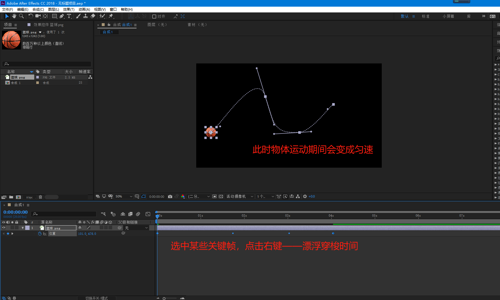
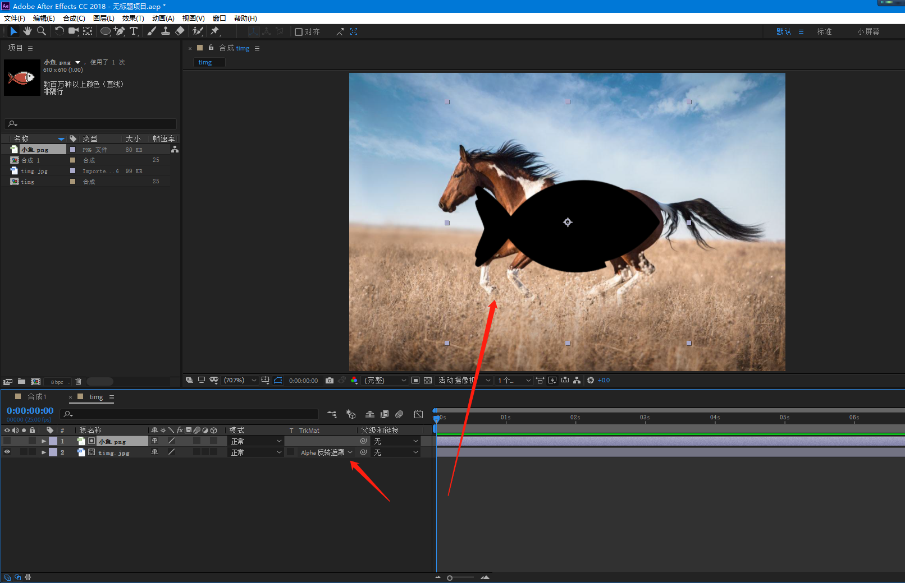

# After Effects

## 首选项

##### 新安装软件必改项

## 新建合成

## 导入素材

#### 图片序列

#### PSD文件

#### rmvb、mkv、flv等

这些视频格式的素材需要先用格式工厂先转换成MP4格式才能导入到ae项目中。

## 图层五大基本属性（锚点、位置、缩放、旋转、不透明度）

##### 锚点工具

一般修改锚点，是用锚点工具来修改，关键帧动画需要在变换属性里面连同位置和锚点一同打上关键帧

## 合成面板、图层面板、素材面板

#### 合成面板（查看器）

## 图层列表面板

#### 父子链接

## 预合成

相当于给某些图层嵌套成一个新合成，类似于pr的嵌套序列

选中某些图层——右键——预合成

## 关键帧动画

用法和pr一样

快捷键u  调出选中图层所有含有关键帧的属性

### 自动定向

选中图层，菜单栏：图层——变换——自动定向（ctrl+alt+o）

### 按时间等比压缩关键帧

### 动画曲线

路径曲线

#### 缓动、缓入、缓出

选中一个或多个关键帧，点击右键——关键帧辅助——缓动（F9）、缓入、缓出

#### 关键帧差值

#### 曲线图表

##### 速度曲线

#### 关键帧定格

#### 漂浮穿梭时间

## 时间

### 快放、慢放

#### 整体

选中图层——右键——时间——时间伸缩。

#### 部分

选中图层——右键——时间——启用时间重映射。AE的部分慢放和快放，视频声音也会跟着快放和慢放。

#### 慢放卡顿问题

### 倒放

选中图层——右键——时间——时间反向图层。取消方式再次点击一遍即可

### 冻结帧

选中图层——右键——时间——冻结帧。只对视频有效。

### 在最后一针冻结

选中图层——右键——时间——在最后一针冻结。只对视频有效。

## 蒙版

蒙版绘制后，也可以勾选反转

### 形状工具

一定要选中图层，再绘制，不选择图层绘制的是形状图层。

#### 个性化蒙版

如果调整过这些工具，第二次使用时会记录下原来调整的样子，这时候想恢复成默认，需要先点击图层，然后双击一下对应的绘制工具按钮，再单击绘制工具按钮进行绘制即可。

下面图片里写的一直按左键和一直按右键是指方向键

下面图片里写的一直按左键和一直按右键是指方向键

### 钢笔工具

蒙版羽化工具，用的比较少，因为蒙版属性中有羽化属性，还能做关键帧动画

### 蒙版属性

### 多个蒙版布尔运算

## 轨道遮罩

## 保存低版本

菜单栏：文件——另存为——将副本另存为CC(14)…   AE CC2017版本

菜单栏：文件——另存为——将副本另存为CC(13)…   AE CC2015版本

## 清理缓存

项目太大，特别卡时，可以尝试清理一下缓存

菜单栏：编辑——清理——清理所有内存与磁盘缓存

## 输出单帧

菜单栏：合成——帧另存为——Photoshop图层

需要先选中合成工作面板，才能输出单帧，只能输出PSD文件，并且包含所有图层，PSD文件每个图层对应合成的每个图层。

## 输出

下载quicktime播放器

## 项目转移、备份

菜单栏：文件——整理工程(文件)——收集文件

收集成功后，即可整个目录转移或备份

## 实用快捷键

##### 重复

ctrl+d   相当于同时复制和粘贴两步操作

##### 拆分图层 

ctrl+shift+d  在时间轴滑块位置，将图层拆分成两个图层

##### 显隐图层控件

ctrl+shift+h  比如灯光图层控件挡住视图某个重要部位时，可以暂时先隐藏图层控件，调整完毕后再显示出来

##### 视图缩放

滚轮键

##### 手型工具

鼠标中键  拖动视窗位置

##### 时间轴

u  调出选中图层所有含有关键帧的属性

home  或  end   快速定位到第一帧或最后一帧

pgup上一页  或  pgdn下一页  向前一帧或向后一帧

i 或 o  快速将时间轴定位到选中图层的入点或出点

[  或  ]  快速将选中图层左边或右边定位到时间滑块线

alt+[   或   alt+]    快速裁去选中图层的时间滑块左或右边部分

##### 图层位置

ctrl+[   或   ctrl+]   选中图层下移或上移一层

ctrl+shift+[   或   ctrl+shift+]   选中图层移至最底层或移至最顶层