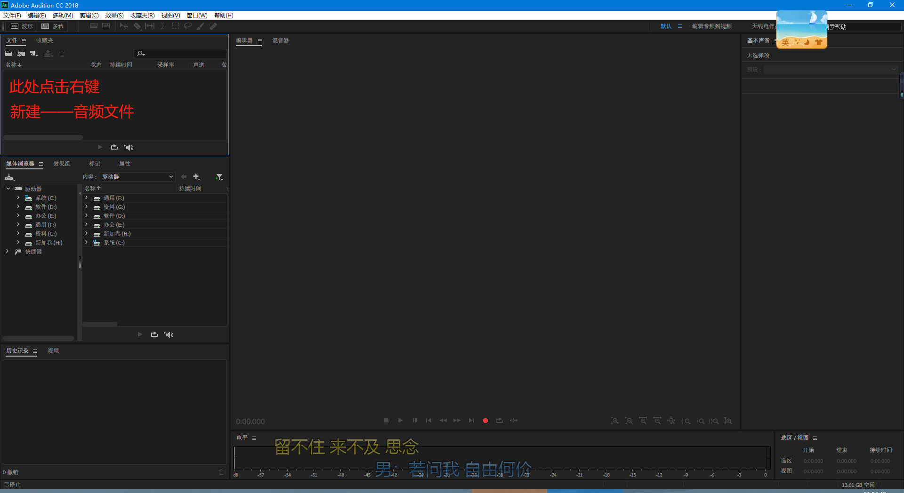
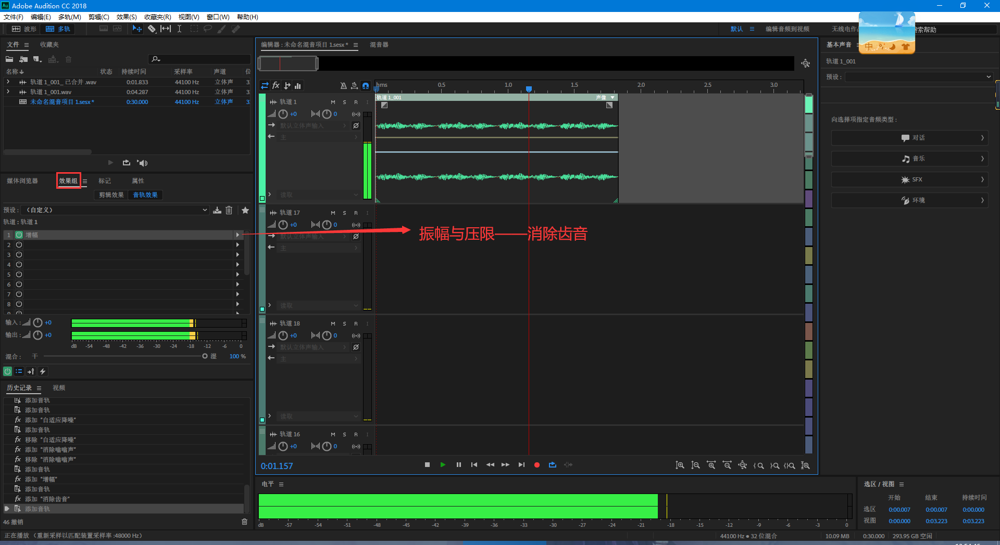

# Audition CC

## 准备工作

- 独立声卡
- 麦克风

## 基本配置

- 编辑——首选项——音频硬件

设备类型：有独立声卡选择ASIO，没有就用MME

- 编辑——编辑快捷键

根据自己的习惯自定义

## 录音技巧

录音前要先确认麦克风是否可用，录音时请使用耳机，不要开音响

#### 简单的录音方式（不实用）

根据声卡级别选择采样率，主控单声道和立体声根据需求选择

点击录制按钮，录完后可以播放

#### 实用的录音方式

根据声卡级别选择采样率，主控单声道和立体声根据需求选择

先点击轨道又上方的R按钮，再开始录音

多轨道的使用可以支持多个音频输入设备（男女混合演唱，一人一个话筒）

## 工程管理及混缩

#### 导入音频文件至多轨混音项目

- 文件窗口——导入——选择要导入的音频文件   

- 右键点击音频文件——插入多多轨混音中

#### 导出音频文件

文件——导出——多轨混音

## 常用音频编辑技巧

#### 时间指针定位

- 直接拉动指针
- 在时间上滚动
- 精准定位：直接编辑时间

#### 轨道缩放功能

- 横向缩放

  

- 纵向缩放

#### 拆分

选中节点，点击右键——选择拆分

#### 复制

按住alt键+左键拖动某一段音频

#### 合并

选中多个音频剪辑，点击右键——合并剪辑

#### 控制声音大小

注意这两种方法是完全独立的

#### 控制左右声道

注意这两种方法是完全独立的

#### 淡入淡出

## 轨道效果功能

建议不要切换到单轨上加效果，因为是直接处理声音，不能还原。下面的方法都是多轨加效果。

#### 预设效果

#### 自定义效果

#### VST增效

需要先下载VST相关的扩展包

然后点击效果——音频增效工具管理器

## 去噪

建议不要切换到单轨上去噪，因为是直接处理声音，不能还原。下面的方法是多轨去噪。

## 音量增幅

前面“常用音频编辑技巧”——“控制声音大小”可以调节音量增幅，但是使用增幅效果器会更好。

- 增幅效果器

## 去除齿音

## 科学滤波器

选择科学滤波器

## 均衡器

均衡器段数越高，可调节的更细致

## 参数均衡器

## 压缩效果器

#### 单频段压缩器

#### 电子管建模压缩器

效果最好的压缩器

#### 动态处理

调节比较自由的压缩器，不适合新手用。唯一可以调节声音硬度的压缩器。

#### 限制器

限制器一般加在主线轨道上；可以把大的声音变小，小的声音变大。

#### 多频段压缩器

相当于在不同频率段上加4个电子管建模压缩器

## 混音效果器

#### 混响

#### 室内混响

混响->室内混响

#### 卷积混响

混响->卷积混响

#### 完全混响

最好的混响效果器

混响->完全混响

## 消除人声制作伴奏

## 调音台

