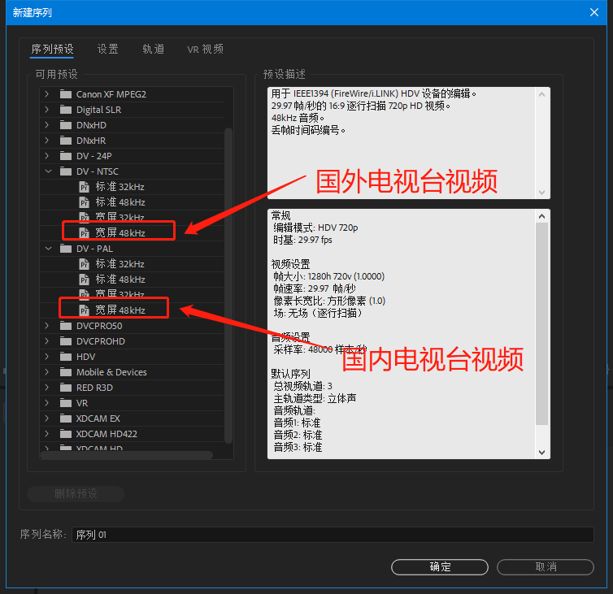
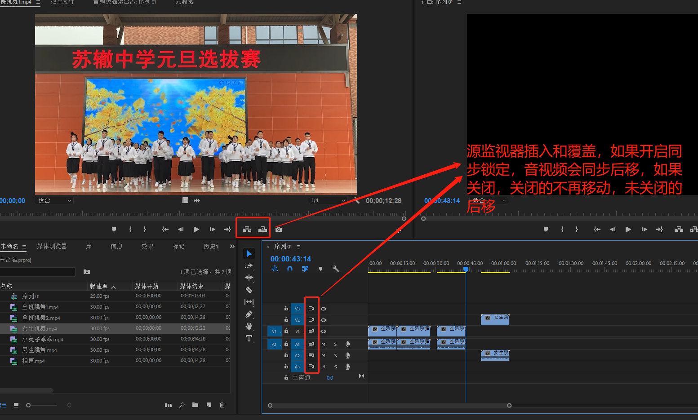

# Premiere cc

## 项目规范

## 序列设置

## 工作区窗口

窗口可以任意布局，调整完后可以保存工作区。在其他电脑打开项目时，也可以勾选上方“窗口”->“工作区”->“导入项目中的工作区”，那么工作区界面就会是上次的布局。

#### 多屏幕布局

可以按住ctrl键把窗口拖动到另外的屏幕上。

#### 重置为初始窗口布局

点击上方“窗口”->“工作区”->“重置为保存的布局”。

## 首选项

### 时间轴

##### 视频过渡默认持续时间

##### 音频过渡默认持续时间

##### 静止图片默认持续时间

上方“编辑”->“首选项”->"时间轴"

## 导入素材

##### 图片序列

##### PSD文件

## 修正素材

如果导入的素材和原始素材有出入，要进行修正

在素材上点击右键->"修改"->“解释素材”

## 多素材自动生成序列

## 项目素材面板中播放视频

单击左键：弹出进度条

j键：后退

l键：暂停

l键：播放

快速点击l键：快进

## 源监视器和节目监视器

### 视频中标记入点出点

快捷键：i键和o键

标记出入点后可将该区间插入或覆盖到时间轴指定的位置

清除出入点直接点击右键即可

### 将视频画面导出为图片

### 单独拖动音视频

源监视器独有

### 剪辑的插入、覆盖和缝隙

源监视器独有

直接拖动剪辑到另外一个剪辑前面会覆盖另外一个剪辑

按住ctrl键拖动剪辑到另外一个剪辑前面会插入到另外一个剪辑前面，但后面会留下原来剪辑长度大小的缝隙

按住ctrl+alt键拖动剪辑到另外一个剪辑前面会插入到另外一个剪辑前面，后面不会留下原来剪辑长度大小的缝隙

## 删除剪辑

选中剪辑直接按delete键，时间轴会留下空隙

选中剪辑按shift+delete键，时间轴不会留下空隙

## 时间轴上多选剪辑

同时按住shift键选择

## 时间轴上标记出入点，并删除区间

快捷键：i键和o键

## 时间轴面板左上方工具

#### 标记

可以在时间轴上或素材上做标记；相当于提示信息

##### 添加标记

快捷键：m键

未选中素材，添加到时间轴上，和节目监视器标记同步，

选中素材，添加到素材上，和源监视器标记同步

##### 编辑标记

双击标记图标

##### 删除标记

删除当前标记：ctrl+alt+m

删除所有标记：ctrl+shift+alt+m

## 时间轴轨道工具

#### CTRL+V粘贴至轨道

#### 源监视器插入和覆盖的轨道

#### 轨道同步锁定

#### 音频静音、独奏、录音

## 时间轴右键菜单

#### 粘贴删除属性（效果及关键帧动画）

即只粘贴或删除视频效果及关键帧动画和音频效果及关键帧动画

注意：如果粘贴时勾选缩放属性时间，那么关键帧动画会按剪辑时长等比缩放

#### 启用（不显示某个剪辑）

#### 取消连接（音视频分离）

选中剪辑点击右键->“取消连接”

#### 编组

编组后，选择时会直接选择编组内所有剪辑

#### 嵌套序列

如果对多个序列有同样的操作，那么可以使用嵌套序列

选中多个序列，点击右键->"嵌套"

双击嵌套序列

#### 视频速度和持续时间

选中剪辑，点击右键->“速度/持续时间”

##### 整个剪辑快放、慢放

如果是中间的剪辑，要注意改变后的波纹长度出现缝隙的问题

如果要改变剪辑速度来填充波纹缝隙，要使用比例拉伸工具

注意要波纹编辑工具左键图标两秒钟，副菜单才会出现

填充缝隙后，剪辑播放速度和持续时间也会相应的改变

##### 整个剪辑倒放

#### 帧定格

- 帧定格选项

把视频的画面定格到某帧上，即视频变成静帧图片，音频不会被定格

- 添加帧定格

把视频的画面定格到当前帧上，即当前帧后面的视频变成静帧图片，音频不会被定格

- 插入帧定格分段（用的最多）

把视频的画面在当前帧上暂停一段时间，暂停时没有声音

#### 缩放为帧大小/设为帧大小

缩放为帧大小：自动缩放成当前序列的帧大小，但是视频控件里面的缩放依然为100%

设为帧大小：自动缩放成当前序列的帧大小，但是视频控件里面的缩放会相应改变

## 视频过渡效果

设置默认过渡效果：ctrl+d

选择一个效果点击右键可设为默认过渡效果

默认过渡持续时间在首选项的时间轴中修改

细化过渡设置

#### morphcut（平滑跳切）

使用场景：连续的画面裁剪中间的部分后，使用这个过渡效果后，原来出现的突然跳动画面会变得平滑，使用时会进行后台运算需要稍作等待，过渡时间可稍微设置短一些

## 音频过渡效果

细化过渡设置

## 切断剪辑

快捷键：ctrl+k

## 视频透明度

如果完全不透明，那么就是黑色，当然也可以添加其它颜色的遮罩层

也可以添加视频关键帧，用法同视频速度

## 替换剪辑

在替换剪辑上选好入点

然后按住alt键把替换剪辑拖动到时间轴对应位置，就能完全匹配长度

## 工具栏

#### 精确修剪

按住ctrl键切换模式

红色：修剪后会出现缝隙

黄色：修剪后不会出现缝隙，但是总体时间会变化

红双线：修剪后不会出现缝隙，总体时间不会变化

双击符号（或者shift+t）进入修剪编辑模式（快捷键jkl同用在此模式可用）

多选修剪（一般只在开头和结尾使用）

#### 快放慢放

比率拉伸工具，准确修改请选中剪辑右键选择“视频速度和持续时间”操作

#### 外滑

只对修剪后的剪辑有效，不改变剪辑长度，改变自己的起始点，周围剪辑的起始点不变，总时长一般不会改变

#### 内滑

不改变剪辑长度和自己的起始点，会改变周围剪辑的起始点，总时长一般不会改变

## 关键帧

视频关键帧和音频关键帧用法基本一致

时间轴面面板显示关键帧曲线

在线上ctrl+左键可以添加关键帧

#### 保存预设

可以把多组效果关键帧动画保存成预设，方便下次调用

## 多机位剪辑

主要是对多个角度拍摄的视频做处理

选中所有机位视频素材，注意第一个选中的机位为相机1，点击右键“创建多机位源序列”

把多机位源序列创建为新序列

切换多机位视图

点击播放

当然，如果选择入点同步点时，觉得入点没对齐时，可以选择多机位源序列，点击右键“在时间轴内打开”，重新调整

## 音频处理

#### 音频工作区

上方“窗口”-“工作区”-“音频”

#### 音频增益

选中音频点击右键-“音频增益”

一般调整标准化最大峰值为0或标准化所有峰值为0

#### 音量效果

1. 音量（切勿打开旁路）
2. 声道音量（切勿打开旁路）
3. 声像器（调整声音在左右声道的偏向量）

需要在时间轴设置中先显示音频关键帧，他们三个的用法都和视频关键帧一样

#### 音频效果

#### 污点修复

选中音频，点击右键“在AU中编辑剪辑”

## 视频效果

#### 众多效果

羽化边缘、残影、变形、旋转、模糊、锐化、扭曲、马赛克……

#### 32位和YUV

如果格式是32位或者YUV，最后渲染也想输出原格式，那么视频效果只能用对应的32位或YUV

#### 稳定抖动画面

注意：该效果需要花费大量分析处理时间

#### 抠像

视频效果-键控-超级键（极致键）

#### 无用信号去除

## 字幕

### 标题字幕

适合做样式复杂的字幕

上方，文件-新建-旧版字幕

### 片尾滚动字幕

### 视频字幕

## 项目管理（转移和备份）

上方：文件-项目管理

## 输出

上方：文件-导出-媒体   快捷键：ctrl+m

下面是常见的输出格式和格式预设

## 队列输出

因为输出需要耗费大量时间，并且该期间不能使用pr，所以可以使用队列方式输出，但是需要安装Adobe Media Encoder软件

## 实用技巧

### 多画面图片大小一致

### 视频局部快放、慢放

注意视频局部快慢放后，音频不会跟着快慢放，仅适合无声音视频

